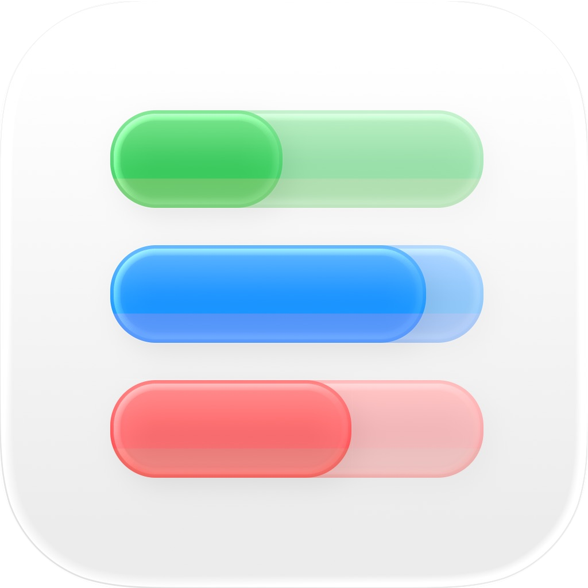

<div align="center">



# Next Level Academia

### Sistema de Gestão Profissional para Academias e Ginásios

**Desenvolvido por [NEXT LAB](https://github.com/ivaldinofortes) · Cabo Verde 🇨🇻**

[](https://github.com/ivaldinofortes/next-level-app/releases)
[](https://electronjs.org)
[](https://react.dev)
[](https://typescriptlang.org)
[](https://sqlite.org)
[](https://github.com/ivaldinofortes/next-level-app/releases)

</div>

---

## 📖 Sobre o Projeto

O **Next Level Academia** é uma aplicação desktop nativa, completa e offline-first, desenvolvida especificamente para o mercado de gestão de academias, ginásios e estúdios de Cabo Verde e países lusófonos. O sistema permite gerir matrículas, cobranças, comunicação com alunos e relatórios operacionais — tudo sem precisar de ligação à internet.

A filosofia de design é baseada em **densidade de informação com clareza visual**, inspirando-se nas interfaces nativas de aplicações desktop modernas (Windows 11 / macOS), sendo que toda a interface foi construída do zero, sem dependências pesadas de bibliotecas de componentes UI.

> **"Rápido como uma aplicação nativa. Poderoso como um sistema ERP. Simples como uma planilha."**

---

## ✨ Funcionalidades Principais

### 👥 CRM e Gestão de Alunos
- **Matrícula Completa:** Registo detalhado com dados pessoais, biométricos, objetivos e plano de pagamento
- **Timeline Inteligente:** Filtro temporal cumulativo — visualize a base de clientes exatamente como estava em qualquer mês passado
- **Perfil Ultra-Compacto:** Painel de detalhes em grelha de 3 colunas (Perfil, Finanças, Comunicação) sem necessidade de scroll
- **Soft Delete:** Alunos eliminados são arquivados, preservando todo o histórico financeiro
- **Upload de Foto:** Fotografias de perfil guardadas localmente no sistema de ficheiros

### 💰 Gestão Financeira
- **Registo de Pagamentos:** Suporte a múltiplos métodos (Dinheiro, Cartão, Transferência)
- **Histórico por Aluno:** Rastreamento completo de mensalidades pagas e em atraso
- **Relatórios Mensais:** Geração de dossiers operacionais em Excel (`.xlsx`) multi-folha
- **Integração WhatsApp:** Geração automática de links `wa.me` com mensagens de cobrança pré-formatadas
- **Validação de Dados:** Bloqueios lógicos para valores inválidos ou métodos omissos

### 🔔 Notificações e Alertas
- Notificações nativas do sistema operativo para eventos críticos
- Alertas de backup periódico configuráveis

### ⚙️ Administração e Segurança
- **Multi-Utilizador:** Suporte a perfis `admin` e `operational` com níveis de acesso distintos
- **Autenticação Segura:** Palavras-passe encriptadas com `scrypt` + Salt aleatório (sem texto plano em nenhum momento)
- **Auditoria Total:** Registo de logs de todas as ações críticas (quem fez, quando e o quê)
- **Backups em ZIP:** Empacotamento completo da base de dados + fotografias num único ficheiro `.zip`
- **Restauro de Backup:** Restauro com um clique a partir de ficheiro `.zip`
- **Licenciamento Integrado:** Sistema de chaves de licença por cliente (teste / comercial / expiração)

### 🏢 Configurações da Academia
- Nome, logótipo, morada, email e telefone da academia
- Categorias de planos personalizáveis (Musculação, Cardio, Crossfit, etc.)
- Template de mensagem WhatsApp totalmente editável
- Pasta de destino de backups e exportações configurável e persistente

---

## 🛠️ Arquitetura e Stack Tecnológica

O projeto segue a **arquitetura de dois processos do Electron** (Main + Renderer) com comunicação via IPC (Inter-Process Communication).

```
┌──────────────────────────────────────────────────────┐
│                   RENDERER PROCESS                   │
│                                                      │
│   React 19 + TypeScript + Vite + Tailwind CSS        │
│   src/App.tsx  ←→  src/RootPanel.tsx                 │
│   src/lib/billing.ts (Lógica de Cobrança)            │
│                                                      │
│              IPC via ipcRenderer                     │
└───────────────────┬──────────────────────────────────┘
                    │ IPC Handlers
┌───────────────────▼──────────────────────────────────┐
│                    MAIN PROCESS                      │
│                                                      │
│   main.cjs (Electron + Node.js)                      │
│   ├── better-sqlite3 (Base de Dados Local)           │
│   ├── adm-zip (Backups em ZIP)                       │
│   ├── xlsx (Exportações Excel)                       │
│   ├── crypto (Hashing de Passwords)                  │
│   └── Sistema de Licenciamento                       │
│                                                      │
│   nextlevel.db → userData do Electron                │
└──────────────────────────────────────────────────────┘
```

### 📦 Dependências de Produção

| Pacote | Versão | Função |
|--------|--------|--------|
| `electron` | 31.7.7 | Runtime Desktop |
| `react` | 19.2.5 | Framework de UI |
| `better-sqlite3` | 12.9.0 | Base de Dados Local |
| `adm-zip` | 0.5.17 | Backups em ZIP |
| `xlsx` | 0.18.5 | Exportação Excel |
| `jspdf` + `jspdf-autotable` | 4.2.1 / 5.0.7 | Geração de PDFs |
| `lucide-react` | 1.8.0 | Ícones |

### 🔧 Ferramentas de Desenvolvimento

| Ferramenta | Versão | Função |
|------------|--------|--------|
| `vite` | 8.0.9 | Build Tool + Dev Server |
| `typescript` | 6.0.2 | Type Safety |
| `tailwindcss` | 3.4.1 | Estilização Utilitária |
| `electron-builder` | 24.13.3 | Empacotamento e Instaladores |
| `@electron/rebuild` | 4.0.4 | Recompilação de módulos nativos |

---

## 🗃️ Modelo de Dados (SQLite)

```sql
-- Alunos com suporte a Soft Delete
alunos (id, nome, telefone, email, sexo, data_nascimento,
        morada, alergias, objetivos, horario_preferido,
        plano, vencimento, categoria, modo_cobranca,
        data_matricula, status, foto_path, notas, deleted)

-- Histórico Financeiro Completo
pagamentos (id, aluno_id, valor, status, data_pagamento,
            metodo_pagamento, mes_referencia,
            referencia_inicio, referencia_fim)

-- CRM: Notas e Ocorrências
notas_contacto (id, aluno_id, texto, data_criacao)

-- Utilizadores e Controlo de Acesso
users (id, name, email, role, password_salt,
       password_hash, is_active, created_at, last_login_at)

-- Auditoria de Ações
logs (id, acao, detalhes, data_hora, user_name)

-- Configurações Key-Value
configuracoes (chave, valor)
```

---

## 🚀 Instalação e Desenvolvimento

### Pré-requisitos

- **Node.js** `>= 18.x`
- **npm** `>= 9.x`
- **Git**

> ⚠️ O módulo `better-sqlite3` requer binários nativos. Em caso de erro de módulo, consulte a secção [Reconstrução de Módulos Nativos](#-reconstrução-de-módulos-nativos).

### Clonar e Instalar

```bash
# Clonar o repositório
git clone https://github.com/ivaldinofortes/next-level-app.git
cd next-level-app

# Instalar dependências
npm install

# Reconstruir módulos nativos para o Electron
npm run rebuild
```

### Iniciar em Modo de Desenvolvimento

```bash
# Terminal 1 — Iniciar o servidor Vite
npm run dev

# Terminal 2 — Abrir o Electron apontando para o Dev Server
ELECTRON_RENDERER_URL=http://localhost:5173 npx electron .
```

### Build de Produção

```bash
# Gera o bundle do frontend + o instalador nativo
npm run dist
```

O instalador final será gerado na pasta `release/` (Windows: `.exe` NSIS | macOS: `.dmg`).

---

## 🔨 Reconstrução de Módulos Nativos

O `better-sqlite3` compila binários específicos para cada versão do Electron. Se vires um erro de módulo nativo ao arrancar:

```bash
npm run rebuild
```

Este comando executa `electron-rebuild` e recompila todos os módulos nativos para a versão correta do Electron instalada no projeto.

---

## 📦 Scripts Disponíveis

| Script | Comando | Descrição |
|--------|---------|-----------|
| Desenvolvimento (UI) | `npm run dev` | Servidor Vite com HMR |
| Electron (produção local) | `npm run electron` | Corre o Electron a partir dos ficheiros `dist/` |
| Build Frontend | `npm run build` | Compila TypeScript + Vite para `dist/` |
| Distribuição | `npm run dist` | Build + Gera instaladores com `electron-builder` |
| Reconstrução Nativos | `npm run rebuild` | Recompila módulos nativos para o Electron |
| Lint | `npm run lint` | Verificação de código com ESLint |

---

## 🖼️ Interface e Design System

A interface foi construída com uma filosofia de **Desktop Nativo**, afastando-se do paradigma de "site dentro de uma janela":

- **Modais Padronizados (Estilo Windows/macOS):**
  - Cabeçalho com logótipo + título centralizado + botão de fechar
  - Corpo com formulário limpo sobre fundo branco
  - Rodapé fixo com botões de ação (Cancelar | Ação Principal)

- **Sistema de Cores Funcional:**
  - 🔵 **Azul** — Ações de navegação e gestão geral
  - 🟢 **Verde** — Exclusivo para operações financeiras e pagamentos
  - 🔴 **Vermelho** — Zonas de perigo, bloqueios e eliminações

- **Layouts de Alta Densidade:**
  - Substituição de listas longas por grelhas compactas
  - Painel de aluno em 3 colunas (Perfil | Finanças | Comunicação)
  - Timeline temporal de clientes sem scroll desnecessário

---

## 🔒 Segurança

| Aspeto | Implementação |
|--------|---------------|
| Passwords | `crypto.scryptSync` com Salt de 16 bytes aleatórios |
| Comparação | `crypto.timingSafeEqual` (imune a timing attacks) |
| Utilizadores inativos | Bloqueio imediato no login |
| Dados em repouso | SQLite local, nunca enviado para a nuvem |
| Auditoria | 100% das ações críticas são registadas em `logs` |

---

## 🏗️ Estrutura do Projeto

```
next-level-app/
├── main.cjs              # Processo Principal do Electron (backend)
├── index.html            # Ponto de entrada HTML
├── package.json          # Dependências e scripts
├── vite.config.ts        # Configuração do Vite
├── tailwind.config.js    # Configuração do Tailwind CSS
│
├── src/
│   ├── App.tsx           # Componente raiz principal (UI completa)
│   ├── RootPanel.tsx     # Painel estrutural raiz
│   ├── main.tsx          # Entry point do React
│   ├── index.css         # Estilos globais
│   └── lib/
│       └── billing.ts    # Lógica de cálculo de cobrança
│
├── public/               # Assets estáticos (logótipos, banners, ícones)
├── build/                # Recursos para o instalador (icon.png)
├── docs/                 # Documentação técnica e prompts de melhoria
└── dist/                 # Output do build (gerado automaticamente)
```

---

## 📋 Roadmap

### ✅ Concluído (v1.0.0-beta.1)
- [x] Sistema de login com autenticação encriptada
- [x] Gestão completa de alunos (CRUD + Soft Delete)
- [x] Timeline temporal de matrículas
- [x] Histórico e registo de pagamentos
- [x] Notas e ocorrências por aluno
- [x] Sistema de backups (ZIP com DB + fotos)
- [x] Exportação operacional em Excel
- [x] Integração WhatsApp (wa.me)
- [x] Sistema de logs de auditoria
- [x] Gestão de utilizadores (admin + operacional)
- [x] Configurações da academia
- [x] Licenciamento interno (chaves de cliente)
- [x] Empacotamento para Windows (NSIS) e macOS

### 🔜 Próximas Versões
- [ ] Refatorização do `App.tsx` em componentes modulares
- [ ] Sistema de notificações por prioridade (Prioritárias / Relatórios / App)
- [ ] Modal de pagamento com contexto visual completo e resumo
- [ ] Mensagem de boas-vindas automática após nova matrícula
- [ ] Splash screen sem bordas e layout otimizado
- [ ] Relatórios em PDF

---

## 👤 Autor e Créditos

**Ivaldino da Luz Fortes**
- 🌐 GitHub: [@ivaldinofortes](https://github.com/ivaldinofortes)
- 📧 Email: ivaldinofortes@gmail.com
- 🏝️ Cabo Verde 🇨🇻

**NEXT LAB** — Soluções de Software para o Mercado Cabo-verdiano

---

## 📄 Licença

Este projeto é **software proprietário**. Todos os direitos reservados.
A distribuição, cópia ou modificação sem autorização expressa do autor é proibida.

© 2026 Ivaldino Fortes / NEXT LAB. Todos os direitos reservados.

---

<div align="center">
  <sub>Construído com ❤️ em Cabo Verde 🇨🇻 · Powered by Electron + React + SQLite</sub>
</div>
